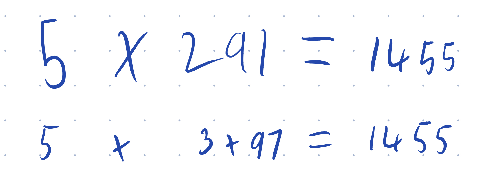

theme: Ostrich, 1
footer: @garyfleming

# TDD For Testers
## A Preview

@garyfleming

^ My name is... I am a...
^ This is a preview. It's wrong.
^

---

# Why?

^ Why Am I talking about TDD to a group of testers? WHy this? Why now? WHY WHY WHY

---

# 1: Confused Speaker

^ Years ago, I went to a talk by a relatively new tester. They'd been relatively new to the industry but were really keen and really smart. The stuff they were saying about testing made a whole heap of sense, and was pretty impressive... until they got to TDD. It was clear it was an idea they hadn't ever really seen done before, and had a whole bunch of misunderstandings about it.

---

# 2: Fear, Anger, Confusion, Anxiety

^ I've long said that agile has failed testers...
^ When I started spending a bit more time working with testers, TDD was often met with these emotions. Fairly emotive responses. Thing is, I kinda think they're understandable. Like so many parts of Agile ways of working, testers havent often been part of the TDD conversation.

---

# 3: TDD Is My Shame

^ It was also a convenient time. The tech talk I've been doing this year is about TDD, so I've been swimming in a soup of ideas surrounding that subject.
^ It's worth noting that the reason I'm doing a talk called "TDD is my Shame" is because... honestly, most developers don't do TDD. It's a tiny percentage of devs who do do it, and it's getting smaller.

---

# Wait, what?

^ The sharper amongst you might be thinking, "Well, if devs don't do it... why the hell are you telling us about it". That's a _great_ question. Really. And we're absolutely going to get to it.

---

# Why should I keep listening?

* TDD: the What.
* Why it matters to Testers
* How to engage with Devs

^ So my purpose here is primarily to educate a little. I think at the very least we can remove some of the fear around TDD by explaining what it is and what it isn't. So thats my first objective. Once it's been demystified, we're also going to talk about why it should matter to Testers more than it does today. And finally, for some of you, we're going to talk about what you can do about it.

---

# You Are Good Enough

^ In the other talk, TDD Is My Shame, I talk about what shame is and conclude that section by saying this that also applies to you: YOU ARE GOOD ENOUGH.
^ If you don't want to listen to this, or learn, or explore the idea, don't worry about it. You do you. You're good enough already. Don't let toxic tech culture put you off.

---

# Part 1. Fear

^ When I say I've seen Fear in testers, it's the fear of the unknown. It's uncertainty. It's doubt. And that's, simply put, a lack of understanding, so let's talk about TDD a bit: What it is, what it isn't

---

* Testing practice... Not really
* Design Strategy... Maybe
* Development practice... Probably

^ Is it a testing practice? Not really. Tests aren't the point in and of themselves. They're useful as an outcome, but that's it. Is it a design strategy? Yeah, maybe. It's a starting point, but probably not sufficient. Is it a development practice? Well..

---

^  I like this by Antony Marcano. It's about Development. Because professional soft dev is more than just writing code. It's harmfully narrow in many ways when devs think their job is only churning out code. That's the last thing you should do. Code is a liability. Write as little as you can, and ensure the code you do write is well-designed and well-tested.

---

# No One True TDD

^ There really isn't one thing called TDD. We like to pretend that TDD is a thing and you can just do it... but that's not quite true. The practices involved and the processes and the people doing it all... mush together. RJ says That's how ideas are. Mushy. It's like a bunch of different play-doh making up something.

---

# Anchor Terms

^ Liz Keogh describes TDD as an anchor term. It's a useful term for searching and tying these mushy ideas together. If you want to know more about ideas in the space, searching for TDD will probably tell you something useful; which is better than trying to find all the individual practices.

---

# The basics: Red - Green - Refactor

^ The most common thing a TDDer will tell a beginner about is the red green refactor loop.
You start by expressing the thing you'd like the code to do that it doesn't currently do by writing a test. What, not how. Idea, not implementation.

---

# The basics: Red

* Assertion Failure
* Unexpected Exceptions
* Missing code

^ Pretty sure I had a 4th one but I can't remember it :shrug:

---

# The basics: Green

^ Just enough code to stop the red thing. No more.

---

# The basics: Refactor

Change code without changing functionality.

---

# Metz Says

* Thorough
* Stable
* Fast
* Few

^ Sandi Metz (POODR) says they should be thorough (logical and complete), Stable (doesn't break when impl details change, without changing behaviour), Fast (don't get run otherwise, lose value), Few (as small as possible to express ourselves)

---

## Essential: Must. See. Test. Fail

^ You must see your test fail

---

## Useful: The loop should be much smaller.

^ TODO

---

## Problem: People forget to Refactor

^ TODO people skip refactoring because they're motivated by getting a requirement done. Also people don't refacor tests

---

## Problem: Red - Green - Refactor isn't enough

^ TODO not enough Requires thought and judgement.

---

## Twist: Selection and Naming

^ TODO insert these into the red-green-refactor diagram
^ Red green refactor are also the wrong place to start IMHO. Beginners often forget to clearly select the requirement they're going to implement, and then to name the test appropraitely. As their understanding changes, they can still refactor this, but not doing so upfront is a GRAVE MISTAKE
^ Cache invalidation/Naming -- Phil Karlton

---

# Part X: Confusion

---

# I am what I am not.

^ We've covered a bunch of what TDD is. Lets talk about what it isn't. This is as vital a piece of knowledge as knowing what it is.

---

# Unit tests

^ TDD isn't unit testing but you helps to understand it first. What is a unit? Turns out most of the folk around at that point in time kinda disagree with each other. It's a mushy idea. What they do agree on?

---

# Unit tests

* No Database
* No network
* No Filesystem
* Must be Parallelisable
* Can't have any weird environment set-up

^ (explain each). What's the intent here? That it's fast and isolated. That it's reliable and deterministic. That it's repeatable. Flaky unit tests are worse than no unit tests.

---

# Test First / Test-Driven Development

^ Now we know what a unit test is, in some vague sense, what is TDD? Just writing the tests first? Well, no, writing the tests first might imply you have already got a fully formed design in mind. Meanwhile, TDD practioners will make it clear that while upfront thinking and design is usually required, they want to allow the forming of the tests to help them do a significant chunk of that. I don't want to be too pedantic or pernickety about this distinction, though.
The two are entwined coding and testing backwards and forward to form design
^ TODO graphic showing thinking and design happening through tests...

---

> "Why would I re-write the tests I've already written in a TDD-fashion"

^ You can't. So don't. As discussed earlier, if you already have tests and code, you can't suddenly magic them into "tdd". It's not an outcome: you can't say you have TDD. TDD is a design process, and creational process. If you didn't use it, it's already too late.

TODO more

---

# Part X: Anger

^ Okay, I've covered what TDD is and what it isn't. Hopefully.

---

> THIS HAS NOTHING TO DO WITH US

^ A frequent response to talking about TDD with testers has been this. It's seen as a developer thing and, as I've laid it out, it kinda is.

^ You've probably never seen a tester get involved with TDD. You've probably never felt that it was something that was for you.

---

> There is nothing so useless as doing efficiently that which should not be done at all. -- Drucker

^ This is the at the heart of modern testing. Making sure the things that are being built are the right things. It really doesn't matter if we have high quality things that are built wrong.

---

## The Right Thing Built Badly is the Wrong thing

^ But... having identified the right thing, you still need to make sure it's of sufficient quality to delight customers. That is: The right thing built badly is the wrong thing. If it's buggy, flaky, smelly, or otherwise moldy it's might look like what they asked for but it's not what they wanted.

---

# Testers are Advocates of Quality

^ Testers have to be advocates of quality. They plain and simply have to because without quality from top-to-bottom, we have nothing of much value.
TODO EXPAND

---

# TDD Is A Quality-first Approach To Software

^ TDD is about quality. It's about having a process through which we attempt (imperfectly) to build quality in. If there were a better process by which developers and testers could build quality in, I would change my mind and advocate for that. I am all ears. Please. Simply, there isn't as far as I can see. Nothing with the rigour and simplicity of focussed design.

---

# Reduce bugs between 40-80%

^ Now, the research shows that teams who work using a TDD process have between 40-80% fewer defects (There's links to that research in the Github repo for this talk.) IF that's the case, then as quality advocates, don't you think that sounds like kinda a big deal? Seems like something you might want to focus on. Cheap, quick, and foundational.

---

> But I Automate Tests At the UI

^ Some testers who work on automation tend to work at a much higher level of automated tests. UI or integration tests. API tests. That kind of thing. That's all useful: keep doing that. But consider that these are higher-levels of abstraction. If the foundations we're building on don't stand up to scrutiny, much of what you're doing is going to be flaky or wasted. It'll be time consuming and less valuable. We need to ensure that we're getting those good quality foundations in first.

---

TODO

---

---

# Part X: Anxiety

^ Okay, by now, I've either convinced you or I haven't. And that's fine. One way or another, You've hopefully learned what TDD is about, whether you want to do anything with that or not. If you don't want to, that's cool. You do you.

---

^ Let's imagine you do want to do something. As rob suggests here, that might not go so well. So what are you going to do about it? How do you practically get involved?

---

# Pairing / Mobbing

^ The simplest thing you could do is join in as a pair, or as part of a mob. You don't need to know how to write code. You can encourage them to not take shortcuts in the cycle. You can help them see gaps in the tests they're writing AS THEY WRITE THEM. That's powerful. Stopping defects from escaping before they're ever committed.

---

# Shift Left
⬅️

^ Talk to devs upfront about how they plan to work. Not just about what they're going to build, but how they'll build it. Encourage them to try TDD. Tell them why: it'll help them have fewer bugs. Provably!

---

# Not Only Shift Left
⬅️➡️↗️↘️⬇️⬆️↙️↖️↕️↔️↪️🔁🔀⤵️🔃🔄⤴️↩️🔂

^ Don't see it as purely something to do on a per story basis. Encouraging a Quality mindset and culture is an ongoing activity that requires constant reinforcement. Become Quality Coaches. Set up Katas for them to practice TDD. It'll help eventually.

---

# Joy

^ At the end of the day, this is what we want to feel. Not Anxiety. Or Fear. Or Confusion

---

# Thank You

https://bit.ly/tdd-testers
https://github.com/garyfleming/tdd-for-testers

@garyfleming
